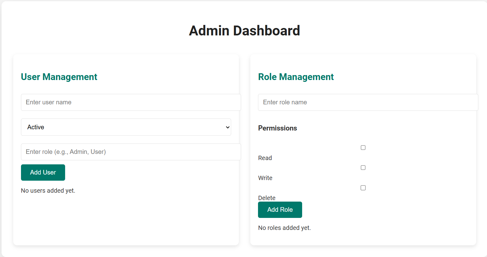

# Admin Dashboard Application

This is an **Admin Dashboard** application built using **React.js**. It allows users to manage **Users** and **Roles**, providing a simple interface to perform actions like adding, editing, and deleting users and roles. The application also allows the assignment of roles and permissions to users.

The application is composed of two main components:

1. **User Management**: Manages user data such as name, status (active or inactive), and role (user or admin).
2. **Role Management**: Manages roles and permissions, allowing admins to create, update, and delete roles, and assign permissions like read, write, and delete.

---

## **Features**

- **User Management**:
  - Add a new user with a name, status (Active or Inactive), and role (User or Admin).
  - Edit existing user details (name, status, role).
  - Delete users.
  - Display user information in a table.

- **Role Management**:
  - Add a new role with a name and a set of permissions (Read, Write, Delete).
  - Edit existing roles and modify permissions.
  - Delete roles.
  - Display roles in a table.

---

## **Technologies Used**

- **React.js**: The primary JavaScript library for building the user interface.
- **CSS**: For styling the application.
- **React Hooks**: For managing component state (`useState`).

---

## **Installation**

1. Clone the repository:

    ```bash
    git clone https://github.com/your-username/admin-dashboard.git
    ```

2. Navigate to the project directory:

    ```bash
    cd admin-dashboard
    ```

3. Install the dependencies:

    ```bash
    npm install
    ```

4. Start the application:

    ```bash
    npm start
    ```

   The app will be available at `http://localhost:3000`.

---

## **Usage**

- The **Admin Dashboard** provides two sections:
  - **User Management**: Allows the admin to create, edit, and delete users.
  - **Role Management**: Allows the admin to create, edit, and delete roles, and assign permissions to these roles.

### **User Management**

- To add a new user, input a name, select a status (active or inactive), and assign a role (User or Admin).
- You can edit the user details or delete users directly from the table.
- The table displays the list of users with their names, statuses, and roles.

### **Role Management**

- To add a new role, input a role name and select permissions (Read, Write, Delete).
- Edit existing roles and change their permissions.
- Roles are displayed in a table with their name and associated permissions.

---

## **Code Structure**

```
src/
├── components/
│   ├── UserManagement.js        # Component to manage users
│   └── RoleManagement.js        # Component to manage roles
├── App.js                       # Main app component
├── App.css                      # Styles for the application
└── index.js                     # Entry point for React app
```

---

## **Screenshots**

Below is a preview of the **Admin Dashboard** UI:

### **User Management**


- You can add, edit, and delete users, as well as manage their status and role.

### **Role Management**


- You can manage roles and assign permissions (Read, Write, Delete).

---

## **Contributing**

Contributions are welcome! To contribute, follow these steps:

1. Fork the repository.
2. Create a new branch (`git checkout -b feature-name`).
3. Commit your changes (`git commit -am 'Add new feature'`).
4. Push to the branch (`git push origin feature-name`).
5. Open a pull request.

---


## **Output Image (Example UI)**



The image above shows the **Admin Dashboard** with both the **User Management** and **Role Management** sections.